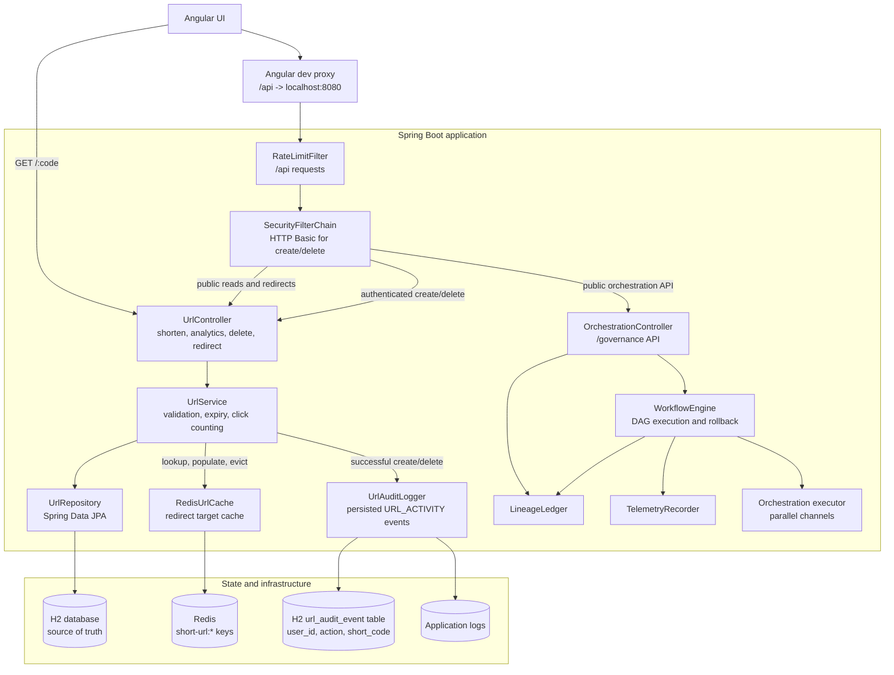

# URL Shortener

Spring Boot API plus an Angular front end. Paste a long URL, get a short one, and see how many
times each link has been followed.

Two screens:

- **`/`** — the shortener and its analytics dashboard.
- **`/governance`** — a control room for the SDLC orchestration engine that models the delivery of
  this service as a six-module pipeline. See [Orchestration engine](#orchestration-engine).

## Layout

```
backend/    Spring Boot 3.3 / Java 21 / H2 (in-memory)
frontend/   Angular 22, standalone components and signals
```

## Architecture



H2 remains authoritative for URL mappings, click counts, and the `url_audit_event` table. Each
successful create or delete persists the authenticated username as `user_id`, along with the
action, short code, and timestamp; the same event is also written as a structured application log.
Redis only accelerates redirect target lookups; a Redis failure falls back to H2. The orchestration
engine is independent in-process state, so its workflow, lineage, and telemetry are not shared
across application replicas.

## Running it

Two terminals. Backend first:

```
cd backend
mvn spring-boot:run          # http://localhost:8080
```

The backend uses Redis at `localhost:6379` to cache short-code redirects. Start Redis locally for
the cache, or run without it: Redis failures fall back to H2 so the application remains usable.
Cached entries expire with the link, and click counts are still written to H2 for every redirect.

Creating and deleting links require HTTP Basic authentication. The local defaults are `admin` /
`change-me`; override `app.auth.username` and `app.auth.password` before exposing the service. The
backend persists a `url_audit_event` row after every successful create or delete, including the
authenticated username as `user_id`, the action, short code, and timestamp. It also writes a
structured `URL_ACTIVITY` log entry. Redirects and read-only analytics remain public.

Then the front end:

```
cd frontend
npm install                  # first time only
npm start                    # http://localhost:4200
```

The dev server proxies `/api` to `localhost:8080` (see `frontend/proxy.conf.json`), so the browser
makes same-origin calls and no CORS setup is needed in development.

Data lives in an in-memory H2 database, so **links are gone when the backend restarts**. Inspect
the tables while it runs at http://localhost:8080/h2-console using the JDBC URL from
`application.properties`, user `sa`, and an empty password.

## Tests

```
cd backend  && mvn test      # 67 tests: JUnit 5 + MockMvc
cd frontend && npm test      # 34 tests: vitest + HttpTestingController
```

## API

| Method   | Path                          | Purpose                                     |
| -------- | ----------------------------- | ------------------------------------------- |
| `POST`   | `/api/v1/shorten`             | Create a short link (`201`)                 |
| `GET`    | `/api/v1/analytics`           | List links, newest first (`?page=&size=`)   |
| `GET`    | `/api/v1/analytics/summary`   | Totals across every link                    |
| `GET`    | `/api/v1/urls/{code}`         | Link details and click count                |
| `DELETE` | `/api/v1/urls/{code}`         | Delete a link (`204`)                       |
| `GET`    | `/{code}`                     | Redirect to the target (`302`) and count it |

Create a link:

```
curl -u admin:change-me -X POST http://localhost:8080/api/v1/shorten \
  -H 'Content-Type: application/json' \
  -d '{"url":"https://example.com/a/very/long/path","customAlias":"demo","expiresInDays":30}'
```

```json
{
  "shortCode": "demo",
  "shortUrl": "http://localhost:8080/demo",
  "longUrl": "https://example.com/a/very/long/path",
  "createdAt": "2026-09-16T16:22:50.655037Z",
  "expiresAt": "2026-10-16T16:22:50.655037Z",
  "clickCount": 0
}
```

`customAlias` and `expiresInDays` are optional. Without an alias the service generates a random
7-character base62 code; without an expiry the link never expires.

Errors come back as JSON with the matching status:

```json
{ "status": 409, "error": "Conflict", "message": "Alias demo is already taken" }
```

`400` invalid URL or field, `404` unknown code, `409` alias taken, `410` link expired,
`429` rate limited (with a `Retry-After` header).

## How it works

- **Codes are random, not sequential.** `Base62Encoder` encodes a `SecureRandom` value padded to a
  fixed width, so codes cannot be walked to enumerate everyone's links. A collision is detected by
  the unique index and retried (`app.max-code-attempts`).
- **Only `http` and `https` targets are accepted.** The stored URL is echoed into a `Location`
  header, so allowing `javascript:` or `data:` would make every short link a script-injection
  vector.
- **Clicks are counted with an UPDATE, not a read-modify-write**, so concurrent redirects do not
  lose increments.
- **Redirect targets are cached in Redis** with the same lifetime as the link. Cache failures fall
  back to H2, and cache hits still execute the click-count update.
- **Redirects use `302` with `Cache-Control: no-store`** so browsers keep coming back through the
  service and clicks keep being counted.
- **Rate limiting is a per-IP token bucket** over `/api/**` only; redirects are never limited.

## Orchestration engine

The `/governance` screen drives a stateful workflow engine that models delivering this service as
six pipeline modules. The routing is a DAG rather than a list:

```
Requirements -> Architecture -+-> Implementation --+
                              |                    +-> [barrier] Testing -> Release Readiness
                              +-> Documentation ---+                          (human approval)
```

Implementation and Documentation are dispatched together onto a worker pool, so they run
concurrently; Testing has two incoming edges and is held by an explicit synchronization barrier
until both channels arrive. Governance controls:

- **Bounded retries** — three attempts per module, then the run gives up.
- **Automated rollback** — on the third failure the engine halts anything still in flight and
  restores the checkpoint taken before the current stage. The offending module stays `FAILED` so the
  grid still shows where it broke; a manual step resumes from the restored checkpoint.
- **Human approval** — Release Readiness parks at `AWAITING_APPROVAL` until a verification key is
  posted. The key is never written to the ledger, only the fact that one was accepted and by whom.
- **Lineage** — every dispatch, transition, retry, barrier wait and rollback is appended to a
  bounded, sequence-numbered ledger that survives a reset.

| Method | Path                                    | Purpose                                     |
| ------ | --------------------------------------- | ------------------------------------------- |
| `GET`  | `/api/v1/orchestration/state`           | Whole graph, barrier, gate and telemetry    |
| `GET`  | `/api/v1/orchestration/lineage`         | Ledger records, oldest first (`?limit=`)    |
| `POST` | `/api/v1/orchestration/start`           | Start a run (`409` if one is in progress)   |
| `POST` | `/api/v1/orchestration/step`            | Manual step; resumes after a rollback       |
| `POST` | `/api/v1/orchestration/failures/{mod}`  | Arm an anomaly (`?persistent=true`)         |
| `POST` | `/api/v1/orchestration/approve`         | Process the verification key                |
| `POST` | `/api/v1/orchestration/reset`           | Return every module to `PENDING`            |

Module work is simulated: `app.orchestration.module-latency-ms` stands in for real delivery effort,
since there is nothing to actually compile here. State lives in the one JVM, so a second replica
would run its own independent pipeline.

To watch a rollback: **Start run**, pick a module, press **Force rollback**, then
**Resume from checkpoint**.

## Configuration

All keys live in `backend/src/main/resources/application.properties`.

| Key                                | Default                 | Notes                                    |
| ---------------------------------- | ----------------------- | ---------------------------------------- |
| `spring.data.redis.host`           | `localhost`             | Redis host for redirect caching          |
| `spring.data.redis.port`           | `6379`                  | Redis port for redirect caching          |
| `spring.data.redis.connect-timeout` | `500ms`                | Fast fallback when Redis is unavailable  |
| `spring.data.redis.timeout`         | `500ms`                | Redis command timeout                   |
| `app.base-url`                     | `http://localhost:8080` | Prefix for the returned `shortUrl`       |
| `app.auth.username`                | `admin`                 | Basic-auth user for create/delete        |
| `app.auth.password`                | `change-me`             | Basic-auth password; override in deploys |
| `app.code-length`                  | `7`                     | Generated code width (4-10)              |
| `app.max-code-attempts`            | `5`                     | Retries on a code collision              |
| `app.allowed-origins`              | `http://localhost:4200` | CORS origins for `/api/**`               |
| `app.rate-limit.enabled`           | `true`                  |                                          |
| `app.rate-limit.capacity`          | `120`                   | Burst size per client                    |
| `app.rate-limit.refill-per-minute` | `120`                   | Sustained requests per minute per client |
| `app.orchestration.max-attempts`   | `3`                     | Attempts per module before rollback      |
| `app.orchestration.module-latency-ms` | `900`                | Simulated work per module attempt        |
| `app.orchestration.worker-threads` | `4`                     | Pool the parallel channels run on        |
| `app.orchestration.ledger-capacity` | `500`                  | Lineage records retained                 |

## Before using this for real

The defaults are tuned for running on a laptop. For anything public:

- **Swap H2 for a real database.** Point `spring.datasource.*` at PostgreSQL and manage the schema
  with Flyway or Liquibase instead of `ddl-auto=update`.
- **Move rate-limit state out of the JVM.** `RateLimiter` holds its buckets in a local map, so each
  replica enforces its own quota. Use Redis behind more than one instance.
- **Fix the client-IP source.** `RateLimitFilter` trusts the first hop in `X-Forwarded-For`, which a
  caller can forge unless a known proxy sets it.
- **Replace the demo authentication.** The browser currently sends one shared Basic credential,
  the backend keeps one in-memory user, and the password uses `{noop}` encoding. Use an external
  identity provider or user store, hashed passwords, short-lived tokens, TLS, and per-user link
  ownership before treating this as access control.
- **Decide about untrusted targets.** Any public `http(s)` URL is accepted as-is, with no
  safe-browsing or malware check.
- **Persist the orchestration state.** The engine and its ledger are in-memory singletons, so a
  restart loses the run and its audit trail, and a second replica would not share either. Real
  audit-grade lineage needs a durable store, and the approval gate needs authentication so the
  verification key means something.

## Risks, trade-offs and guardrails

The current design is deliberately small and useful for local development. These are the failure
scenarios to validate before deploying it as a shared service:

| Risk or failure scenario | Current trade-off | Required guardrail or validation |
| ------------------------ | ----------------- | --------------------------------- |
| The shared Basic credential is copied into browser JavaScript and can be reused by anyone who can use the UI. | Simple setup, but no individual identity or least privilege. | Use OIDC/OAuth2 or server-side sessions, remove credentials from the bundle, and enforce per-user ownership on create/delete. |
| `app.auth.password` defaults to `change-me` and is configured with `{noop}` encoding. | Convenient local bootstrapping. | Fail startup when the default is used outside a `dev` profile; source secrets from a secret manager or environment, hash stored passwords, and rotate them. |
| Basic credentials and URLs can be exposed over an unencrypted connection or in browser/network logs. | HTTP works without certificates on a laptop. | Require HTTPS in non-local environments, mark credentials as sensitive in proxy/access-log configuration, and never log `Authorization` headers or passwords. |
| Authentication failures can be brute-forced; the existing rate limiter covers `/api/**` but is not an auth-specific policy. | Shared throttling is simple and currently protects the API by client IP. | Add failed-login counters, exponential backoff or lockout, alerting, and tests that verify repeated `401` responses are throttled. |
| Any authenticated user can currently delete any link. | There is one role and no ownership model. | Persist `createdBy`, authorize delete against the authenticated subject, and test cross-user delete as `403`. |
| Audit records are persisted in H2 and mirrored to ordinary application logs after successful mutations. | The audit table is local to one in-memory H2 instance and does not provide durable, centralized retention. | Persist actor/user ID, action, code, request ID, result, and timestamp in durable append-only storage; protect retention and alert on missing or malformed events. |
| A database delete can succeed while Redis eviction fails, leaving a stale redirect until its TTL expires. | Cache failure does not block the user operation. | Treat the database as authoritative, verify delete-then-redirect behavior with Redis available, and use bounded TTLs or a versioned cache key for stronger invalidation. |
| Redis is unavailable or slow. | Redirects fall back to H2 and remain available, at the cost of latency. | Keep connect/command timeouts bounded, alert on fallback frequency, and load-test both Redis-hit and Redis-down paths. |
| A target can point to phishing, malware, private, or loopback infrastructure. | Accepting all HTTP(S) URLs supports general-purpose shortening. | Add abuse screening, domain policy, DNS/IP validation, SSRF protections where applicable, takedown controls, and tests for loopback/private/link-local targets. |
| Redirects are public and intentionally not rate-limited. | Link sharing remains frictionless and click counting stays simple. | Add abuse detection, per-code/IP quotas, concurrency limits, and monitoring for redirect floods without breaking normal sharing. |
| H2 and in-memory orchestration/audit state lose data on restart and do not coordinate replicas. | Zero-dependency local development. | Use durable database migrations, externalized orchestration state, Redis or a queue for shared coordination, backups, and restart/replica recovery tests. |

### Minimum release gate

Before a non-local deployment, validate all of the following:

- The default username/password is rejected by configuration validation or replaced through the
  deployment secret mechanism.
- HTTPS is enforced and no request or response log contains an `Authorization` value or password.
- Anonymous create/delete requests return `401`; authenticated reads remain intentionally public.
- A user cannot delete another user's link, and every successful mutation produces exactly one
  centralized audit event with actor, action, code, timestamp, request ID, and outcome.
- Invalid, expired, private-network, and policy-blocked targets are rejected before persistence.
- Redis hit, Redis miss, Redis timeout, delete invalidation, database outage, and restart scenarios
  have automated tests and observable alerts.
- Rate limits, audit retention, backup/restore, secret rotation, and incident/takedown procedures
  are documented and exercised.
